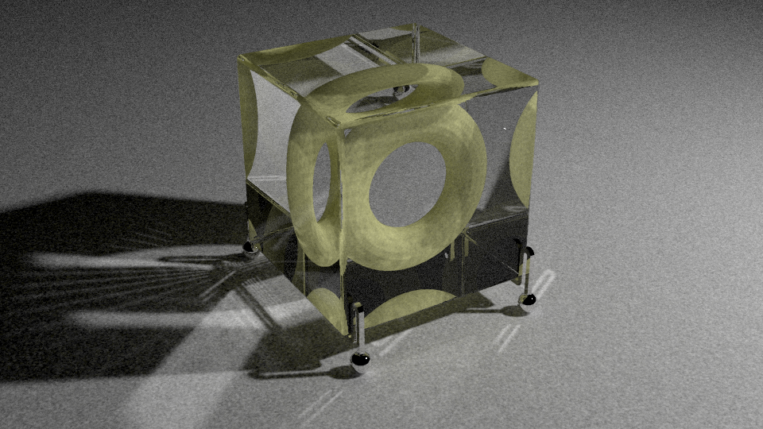

# The-Last-time


## Building

### External libraries
- embree3
- openvdb
- tinyobjloader
- ImGui
- glfw3
- glew
- fmt

If you don't know how to add the three libraries, I recommend you use some package manager like `vcpkg`.  
```bash
 > vcpkg install embree3 openvdb tinyobjloader imgui glfw3 glew fmt:x64-windows  
 > vcpkg integrate install 
```
### Build
Now I just test building it on Windows.   
Please build as x64 platform like
```bash
 > mkdir build
 > cd build
 > cmake -G "Visual Studio 16 2019" ..
```
Or use `./setup_builds.bat`. 

## Project
[Project Website](https://slongle.github.io/projects/The-Last-Time)

### Overview
[This Offline Renderer](https://github.com/slongle/The-Last-time) is a physically-based photorealistic 3D renderer I am writing from scratch in C++. Rainbow is built from the ground up as a global illumination renderer supporting global illumination through light transport algorithms, including volumetric unidirectional pathtracing with multiple importance sampling. The renderer is still a work in progress.  

### Features
**Advanced Global Illumination**: Volumetric Unidirectional Path Tracing (Quasi-Monte Carlo), Stochastic progressive photon mapping, Primary Sample Space Metroplis Light Transport (Kelemen-style MLT), Path Guider (WIP).    
**Geometry**: Support triangle and quad meshes with instancing. Also can support sphere and box.  
**Lights**: Support point light, spot light, area light(rectangle and sphere).  
**Materials and BSDFs**: Support physically based BSDFs, including multiple microfacet models (Beckmann), smooth and rough versions of Fresnel conductors, specular dielectrics, transparent BSDF, blend BSDF.   
**Media**: Support homogeneous and heterogeneous medium.  
**Acceleration Structure System**: Use SAH-BVH acceleration.  
**Render Mode**: Adaptive, Progressive and Final mode.  

### Select Images


<p><center><font size="2">Crepuscular beam</font></center></p>


<p><center><font size="2">Homogeneous medium with HG phase function (density = 10, albedo = 1, g = 0), multi-scatter</font></center></p>


<p><center><font size="2">Stochastic progressive photon mapping, initial radius = 0.2, alpha = 0.5, iteration = 5000</font></center></p>




<p><center><font size="2">Stochastic progressive photon mapping, initial radius = 0.05, alpha = 0.5, iteration = 10000</font></center></p>


<p><center><font size="2">Blend BSDF of smooth dielectric and matte, Au conductor BSDF (convert SPD to RGB)</font></center></p>


<p><center><font size="2">Alpha texture for leaf</font></center></p>


The images below are from my old renderer [Rainbow](https://github.com/slongle/Rainbow).


<p><center><font size="2">Veach thesis multiple importance sampling test scene. Rendered using pathtracing with multiple importance sampling.</font></center></p>

<p><center><font size="2">Homogeneous medium(volumetric caustic WIP)  </font></center></p>  

<p><center><font size="2">Heterogeneous medium </font></center></p>
Rendered using volumetric unidirectional pathtracing.
