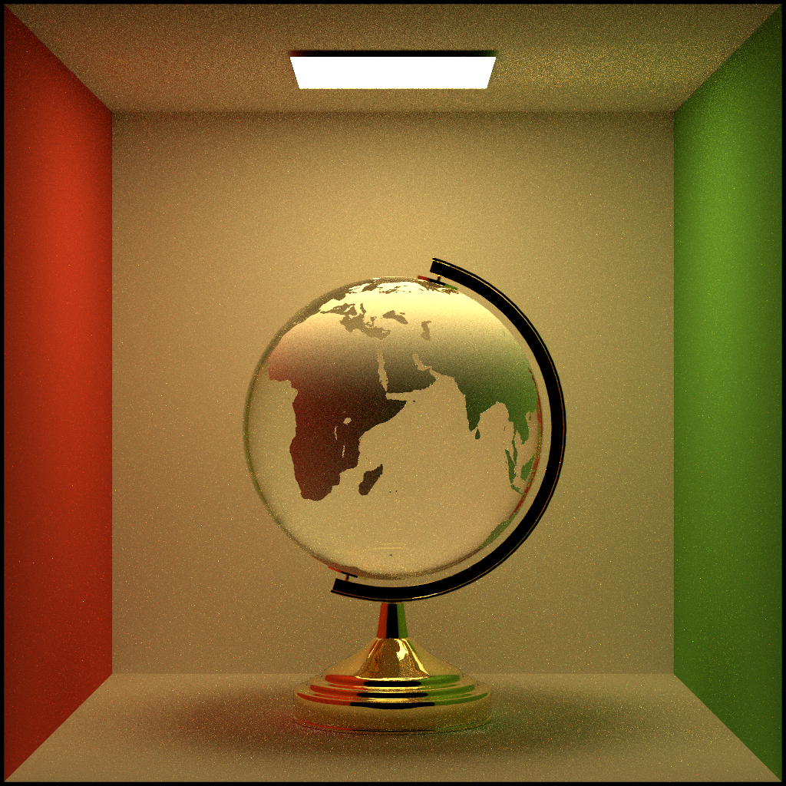

# The-last-time
  


## Building

### External libraries
I recommend you use some package manager like `vcpkg`.  
```bash
 > set VCPKG_DEFAULT_TRIPLET=x64-windows  
 > vcpkg install embree3 openvdb tinyobjloader imgui glad glfw3 glew glm fmt glog nlohmann-json stb openimageio   
 > vcpkg integrate install 
```
### Build
Now I just test building it on Windows.   
Please build as x64 platform like
```bash
 > mkdir build
 > cd build
 > cmake -G "Visual Studio 16 2019" ..
```
Or use `./setup_builds.bat`. 

## Project
[Project Website](https://slongle.github.io/projects/The-Last-Time)

### Overview
[This Offline Renderer](https://github.com/slongle/The-Last-time) is a physically-based photorealistic 3D renderer I am writing from scratch in C++. Rainbow is built from the ground up as a global illumination renderer supporting global illumination through light transport algorithms, including volumetric unidirectional pathtracing with multiple importance sampling. The renderer is still a work in progress.  

### Features
- Advanced Global illumination 
  - Volumetric unidirectional path tracing   
  - Volumetric probabilistic progressive photon mapping(Point estimation and Beam estimation)
  - Primary sample space metroplis light transport (Kelemen-style MLT)(WIP)
  - Path Guider (WIP)
- Geometry 
  - Triangle and quad meshes
- Lights 
  - Point light
  - Spot light
  - Directional light
  - Area light
- Materials and BSDFs
  - Thin-film iridescence
  - Rough conductor and dielectric using microfacet models (GGX)
  - Smooth conductor and dielectric
  - Transparent BSDF
  - Blend BSDF
  - Support alpha texture
- Media
  - Homogeneous medium
  - Heterogeneous medium (OpenVDB file)  
- Acceleration Structure System 
  - SAH-BVH acceleration
  - Embree3
- Render Mode 
  - Adaptive mode
  - Progressive mode
  - Final mode  

### Select Images
  
  
  
Iridescence effect, using the method from Belcour and Barla 2017 (eta_1 = 1.0, eta_2 = 1.33, eta_3 = 1.0, k_3 = 0, d = 300-850nm)   
  
Goniochromism when changing view position, eta_1 = 1.0, eta_2 = 1.33, eta_3 = 1.0, k_3 = 0, d = 550nm, alpha = 0.1    
  
Crepuscular beam  
  
Homogeneous medium with HG phase function (density = 10, albedo = 1, g = 0), multi-scatter  
  
Disney cloud  
  
Smoke(VDB file from [OpenVDB](https://www.openvdb.org/download/))   
  
Smoke(VDB file from [JangaFX](https://jangafx.com/software/embergen/download/free-vdb-animations/))   
  
Initial radius = 0.005, alpha = 0.9, # of delta photon = 1M, iteration = 0.5K     
  
Initial radius = 0.2, alpha = 0.5, iteration = 5000  
  
  
The first image is from path tracing, 1024K spp, 11h59m46s   
The second image is from SPPM, initial radius = 0.08, alpha = 0.5, # of delta photon = 1M, iteration = 1K, 8m48s   

Initial radius = 0.05, alpha = 0.3, iteration = 1000, # of delta photon = 100k  
  
Blend BSDF of smooth dielectric and matte, Au conductor BSDF (convert SPD to RGB)  
  
Alpha texture for leaf  
 
   
Rough conductor, alpha_u = 0.1, alpha_v = 0.1  
   
Rough conductor, alpha_u = 0.005, alpha_v = 0.1  
   
Rough dielectric, alpha_u = 0.1, alpha_v = 0.1  
   
Rough dielectric, alpha_u = 0.005, alpha_v = 0.1  

The images below are from my old renderer [Rainbow](https://github.com/slongle/Rainbow).  
  
  
  
Veach thesis multiple importance sampling test scene. Rendered using pathtracing with multiple importance sampling.  
  
Homogeneous medium(volumetric caustic WIP)  
  
Heterogeneous medium  
Rendered using volumetric unidirectional pathtracing.  
